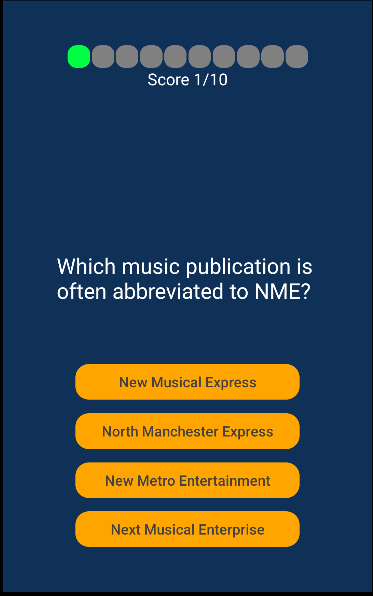

# Mobile Quiz Game

Quiz game for mobile devices made with React Native, Expo and TypeScript. App uses Firebase as a database and for user handling. The questions come from [Open Trivia API](https://opentdb.com/). To get the UI nicer-looking some components from [React Native Elements](https://reactnativeelements.com/) and [React Native Awesome Alerts](https://github.com/rishabhbhatia/react-native-awesome-alerts) were used.

The game has a Quick Quiz mode for unregistered users that simply asks 10 random questions. Registered users can create custom quizes choosing from multiple categories and difficulties. Registered users can also try the challenge which consist of 10 questions from random categories that get harder and harder. Players that pass the challenge get their name on the Wall of Fame.

## Screenshots




## Setting up locally
You need Expo Go app on your mobile phone or an emulator to run the application

### Clone the repo
```
git clone https://github.com/AaltonenSan/mobile-quiz-game.git
```

### Install npm packages
```
cd .\app\
npm install
```

### Firebase
To run the application locally you need your own Firebase account and project setup with Firebase Authentication and Firestore. Create .env file to app root and place the setup variables there as follows:

```
FIREBASE_API_KEY=
FIREBASE_AUTH_DOMAIN=
FIREBASE_PROJECT_ID=
FIREBASE_STORAGE_BUCKET=
FIREBASE_MESSAGING_SENDER_ID=
FIREBASE_APP_ID=
```

### Start the application
```
npx expo start
```

## MIT License

Copyright (c) 2023 Santeri Aaltonen

Permission is hereby granted, free of charge, to any person obtaining a copy
of this software and associated documentation files (the "Software"), to deal
in the Software without restriction, including without limitation the rights
to use, copy, modify, merge, publish, distribute, sublicense, and/or sell
copies of the Software, and to permit persons to whom the Software is
furnished to do so, subject to the following conditions:

The above copyright notice and this permission notice shall be included in all
copies or substantial portions of the Software.

THE SOFTWARE IS PROVIDED "AS IS", WITHOUT WARRANTY OF ANY KIND, EXPRESS OR
IMPLIED, INCLUDING BUT NOT LIMITED TO THE WARRANTIES OF MERCHANTABILITY,
FITNESS FOR A PARTICULAR PURPOSE AND NONINFRINGEMENT. IN NO EVENT SHALL THE
AUTHORS OR COPYRIGHT HOLDERS BE LIABLE FOR ANY CLAIM, DAMAGES OR OTHER
LIABILITY, WHETHER IN AN ACTION OF CONTRACT, TORT OR OTHERWISE, ARISING FROM,
OUT OF OR IN CONNECTION WITH THE SOFTWARE OR THE USE OR OTHER DEALINGS IN THE
SOFTWARE.